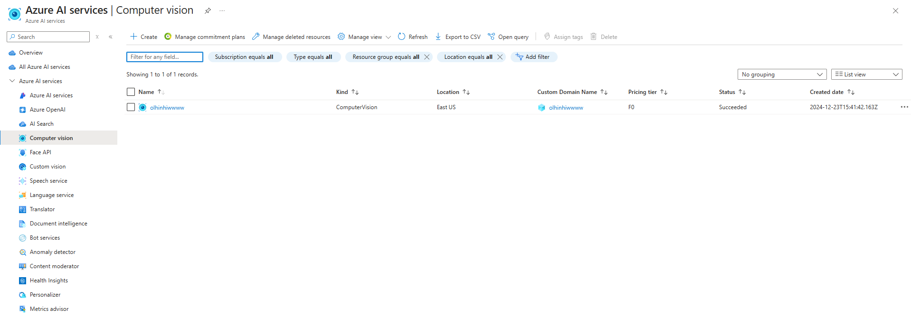
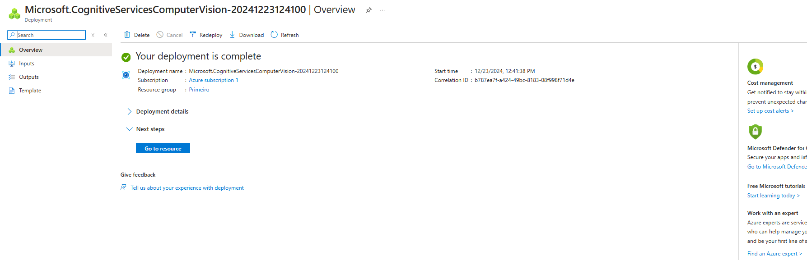
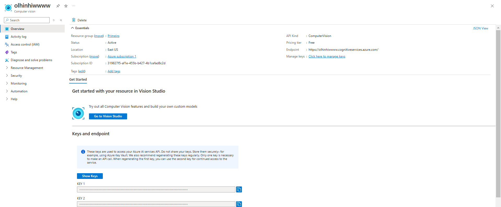
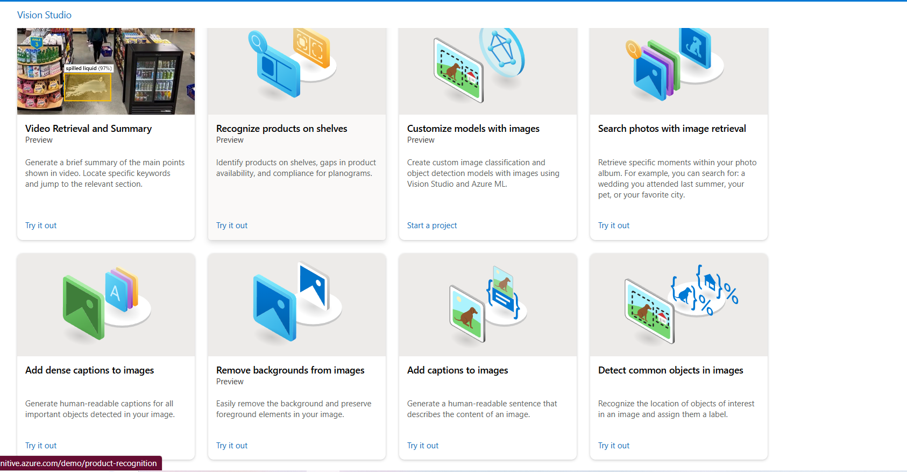
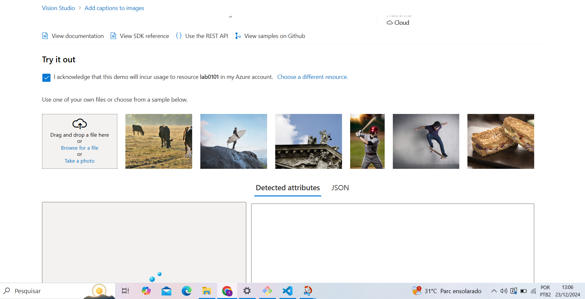

# Explorando os Recursos de IA Generativa com Copilot e OpenAI

## Crie um recurso de visão computacional

## Espere o deploy

## Vá para o studio vision

## Selecione "Add captions to image"

## Utilize o serviço

